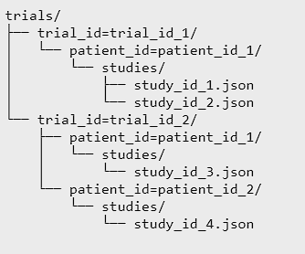
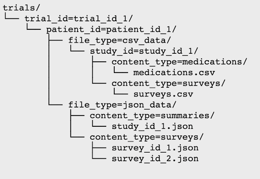

# Architecture Deep Dive

| Index                                   | Description                          |
| :-------------------------------------- | :----------------------------------- |
| [Architecture Flow](#architecture-flow) | Discusses how the architecture works |
| [Log Retention](#log-retention) | Discusses the log retention period of CloudWatch Logs in this project |
| [VPC Networking](#vpc-networking) | Discusses the log retention period of CloudWatch Logs in this project |

## Architecture Flow

### **Data Input Flow of the Mobile App (1-6)**

1. When an administrator ends a study on the app, the app will attempt to send a POST request to an API Gateway with an API key for authentication to retrieve a pre-signed URL to upload to the raw data S3 Bucket.  The POST request passes through an AWS Web Application Firewall which implements the AWS Core rule set rule group and a rate-based rule limiting the number of requests that can be received in a fixed period of time. If the device is not connected to the internet or the uploading fails, the locally stored data will be retained on the device.
2. The API Gateway calls a lambda function which retrieves the pre-signed URL. For authentication, the Lambda function retrieves the stored API key from AWS Secrets manager to ensure the API key sent in the POST request matches the stored API key.
3. This pre-signed URL is then returned back to the mobile app through the API Gateway.
4. The mobile app then compiles a JSON file containing all the data collected in the study and submits the JSON file in a PUT request to the pre-signed URL.

    This is the S3 file structure for the raw data S3 Bucket the mobile app uploads to:\
    

5. The delivery of a JSON file triggers a Lambda function, which receives the event information and retrieves the study JSON file from the raw data S3 Bucket.
6. The Lambda function processes the data sent from the mobile app. Each survey contained in the study JSON file is separated into an individual file and uploaded to the processed data S3 Bucket. A summary json file containing the recorded medication times, study ID, trial ID, patient ID, device ID, and the survey IDs that correspond to the study is generated and uploaded into the processed data S3 Bucket. A CSV file containing the results from all the surveys completed in the study is generated and uploaded into the processed data S3 Bucket. A CSV file containing the recorded times the patient took their medication is also generated and uploaded into the processed data S3 Bucket. 

    This is the S3 file structure for the processed data S3 Bucket:\
    

## Log Retention

Logs generated by the Lambda functions used in this project have been assigned a retention period of **3 months.** This retention policy can be adjusted for each log group. More information can be found [here](https://docs.aws.amazon.com/AmazonCloudWatch/latest/logs/WhatIsCloudWatchLogs.html).

## Networking

### VPC 

The VPC for this project currently utilizes a `10.0.0.0/16` IPv4 CIDR block. The `/16` netmask provides 65,536 IP addresses. More information can be found [here](https://docs.aws.amazon.com/vpc/latest/userguide/vpc-cidr-blocks.html).